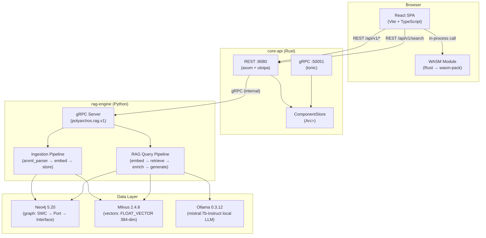

# polyarchos

**AUTOSAR Component Intelligence Platform** — a portfolio-grade, polyglot monorepo that ingests
automotive ECU configurations, stores component relationships in a graph database, surfaces semantic
search via a locally-hosted LLM, and renders everything in a strict TypeScript dashboard.

> Built to demonstrate production-grade engineering across Rust, TypeScript, Python, and WASM for
> roles in automotive software infrastructure (Qorix QD Architect).

---

## System Architecture



---

## Tech Stack

| Layer | Technology | Purpose |
|---|---|---|
| Frontend | React 18, TypeScript strict, Vite 5 | Browser dashboard |
| Frontend state | TanStack Query v5 + Zustand v4 | Server vs client state split |
| Schema validation | Zod v3 | Runtime API response validation |
| WASM | Rust → wasm-pack → ES module | In-browser ARXML parsing |
| Core API | Rust, tonic, axum, utoipa | gRPC :50051 + REST :8080 |
| Domain types | Rust (crates/domain) | Shared SWC/Port types |
| API contracts | Protobuf + buf | Language-agnostic, breaking-change detection |
| RAG engine | Python 3.12, pydantic, fastembed | ML pipeline |
| Embeddings | BAAI/bge-small-en-v1.5 (384-dim) | Local, CPU-friendly |
| LLM | Ollama + mistral:7b-instruct | Offline inference |
| Vector DB | Milvus 2.4.8 (IVF_FLAT, IP metric) | ANN search |
| Graph DB | Neo4j 5.20 | SWC relationship graph |
| Infrastructure | Docker Compose (dev), Kubernetes (prod) | Container orchestration |
| GitOps | Flux / ArgoCD | Declarative cluster reconciliation |
| CI | GitHub Actions (11 steps) | Lint, test, build |

---

## Monorepo Structure

```
polyarchos/
├── crates/domain/          # Shared Rust domain types (SWC, Port, Interface)
├── services/
│   ├── core-api/           # Rust: gRPC + REST API gateway
│   └── rag-engine/         # Python: RAG pipeline + gRPC server
├── wasm/                   # Rust → WASM: browser ARXML parsing
├── frontend/               # TypeScript + React SPA
├── proto/                  # Protobuf definitions (buf-managed)
├── infra/
│   ├── docker-compose.dev.yml   # Local dev stack
│   ├── k8s/                     # Kubernetes manifests
│   └── gitops/                  # Flux/ArgoCD configs
├── scripts/                # Python: ingestion CLI, dev helpers
├── tests/fixtures/         # Synthetic ARXML test data
├── docs/
│   ├── adr/                # Architecture Decision Records (ADR-001 – ADR-009)
│   ├── phases/             # Phase documentation
│   ├── rfc/                # RFC proposals
│   └── CONTROL_AND_DATA_FLOW.md   # End-to-end flow reference
├── Cargo.toml              # Rust workspace
├── pyproject.toml          # Python workspace (uv)
└── package.json            # Node workspace (npm)
```

---

## Phase Status

| # | Phase | Status | Key Deliverable |
|---|---|---|---|
| 0 | Foundation Scaffold | ✅ Complete | Monorepo, CI skeleton, CLAUDE.md |
| 1 | Proto Contracts | ✅ Complete | `polyarchos.core.v1`, `polyarchos.rag.v1` |
| 2 | Core API (Rust) | ✅ Complete | Dual gRPC + REST server, OpenAPI spec |
| 3 | WASM Bindings | ✅ Complete | In-browser ARXML parser, 16 tests |
| 4 | RAG Engine (Python) | ✅ Complete | Ingestion + query pipeline, 29 tests |
| 5 | Frontend (React/TS) | ✅ Complete | 5-page SPA, strict TS, 20 tests |
| 6 | Infrastructure + GitOps | 🔜 Planned | k8s manifests, Flux, Sealed Secrets |
| 7 | CI/CD Hardening | 🔜 Planned | Dockerfiles, release pipeline |
| 8 | Documentation Polish | 🔜 Planned | C4 diagrams, RFC-001, onboarding |

---

## Quickstart (Local Development)

### Prerequisites

```bash
rustup           # Rust toolchain
node >= 20       # Node.js
python >= 3.12   # Python
uv               # Python package manager
buf              # Protobuf toolkit
wasm-pack        # WASM build tool
docker           # Container runtime
```

### 1 — Start the data layer

```bash
docker compose -f infra/docker-compose.dev.yml up -d
# Neo4j browser:  http://localhost:7474  (neo4j / polyarchos)
# Milvus gRPC:    localhost:19530
# Ollama API:     http://localhost:11434
```

### 2 — Pull the local LLM

```bash
docker exec -it polyarchos-ollama ollama pull mistral:7b-instruct
```

### 3 — Generate protobuf stubs

```bash
buf generate
```

### 4 — Start core-api

```bash
cargo run -p core-api
# gRPC  → :50051
# REST  → :8080
# Swagger UI → http://localhost:8080/swagger-ui/
```

### 5 — Ingest sample data

```bash
uv pip install -e services/rag-engine
uv run python scripts/ingest.py --input tests/fixtures/sample.arxml
```

### 6 — Start rag-engine

```bash
uv run rag-engine
# gRPC → :50052
```

### 7 — Build WASM module

```bash
wasm-pack build wasm/ --target web
```

### 8 — Start the frontend

```bash
npm install
npm run dev -w frontend
# http://localhost:5173
```

---

## Running Tests

```bash
# Rust (core-api + WASM)
cargo test --workspace

# Python (rag-engine)
uv run pytest services/rag-engine/tests -v

# TypeScript (frontend)
npm run test -w frontend

# Type checks
cargo clippy --workspace -- -D warnings
uv run mypy services/rag-engine --strict
npm run typecheck -w frontend
```

---

## Documentation Index

| Document | Description |
|---|---|
| [services/core-api/README.md](services/core-api/README.md) | Phase 2 — Rust API gateway |
| [wasm/README.md](wasm/README.md) | Phase 3 — WASM browser bindings |
| [services/rag-engine/README.md](services/rag-engine/README.md) | Phase 4 — Python RAG pipeline |
| [frontend/README.md](frontend/README.md) | Phase 5 — React/TS frontend |
| [infra/README.md](infra/README.md) | Infrastructure and dev stack |
| [proto/README.md](proto/README.md) | Protobuf contracts |
| [docs/CONTROL_AND_DATA_FLOW.md](docs/CONTROL_AND_DATA_FLOW.md) | End-to-end control and data flow |
| [docs/phases/PHASES-OVERVIEW.md](docs/phases/PHASES-OVERVIEW.md) | Full phase roadmap |
| [docs/adr/](docs/adr/) | Architecture Decision Records |

---

## Key Design Decisions

| Decision | Choice | Record |
|---|---|---|
| Monorepo structure | Polyglot, per-language workspaces | [ADR-001](docs/adr/ADR-001-monorepo-structure.md) |
| Language per service | Rust/Python/TS by domain fit | [ADR-002](docs/adr/ADR-002-language-selection.md) |
| API design | Proto-first with buf | [ADR-003](docs/adr/ADR-003-proto-first-api-design.md) |
| Dual server | gRPC + REST in one process | [ADR-004](docs/adr/ADR-004-dual-server-grpc-rest.md) |
| Browser ARXML | Rust compiled to WASM | [ADR-005](docs/adr/ADR-005-wasm-arxml-browser-bindings.md) |
| RAG framework | Hand-rolled, no LangChain | [ADR-006](docs/adr/ADR-006-rag-orchestration-library.md) |
| Local LLM | Ollama + mistral:7b-instruct | [ADR-007](docs/adr/ADR-007-local-llm-selection.md) |
| Offline inference | Air-gap, no external APIs | [ADR-008](docs/adr/ADR-008-offline-inference-architecture.md) |
| Frontend state | TanStack Query + Zustand split | [ADR-009](docs/adr/ADR-009-frontend-state-management.md) |
