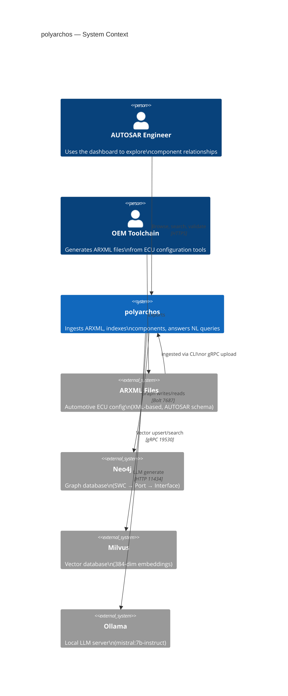
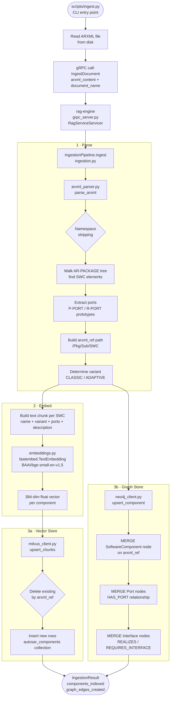
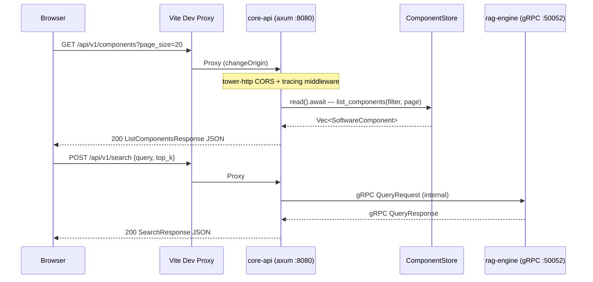
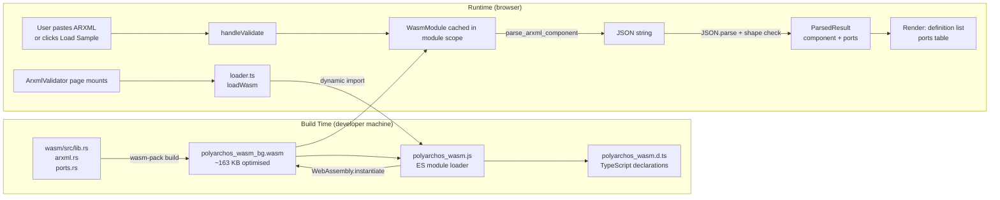
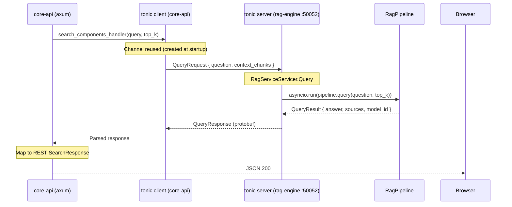

# Control Flow and Data Flow — polyarchos

This document traces every significant path data takes through the system: from raw ARXML files
being ingested, to natural-language queries producing answers, to the browser rendering component
graphs. Read this alongside the per-phase READMEs for implementation details.

---

## Table of Contents

1. [System Boundary Map](#1-system-boundary-map)
2. [Ingestion Flow — ARXML → Databases](#2-ingestion-flow)
3. [RAG Query Flow — Question → Answer](#3-rag-query-flow)
4. [REST API Request Flow — Browser → core-api](#4-rest-api-request-flow)
5. [WASM In-Browser Parsing Flow](#5-wasm-in-browser-parsing-flow)
6. [gRPC Internal Call Flow — core-api → rag-engine](#6-grpc-internal-call-flow)
7. [Frontend State Flow](#7-frontend-state-flow)
8. [Data Models at Each Layer](#8-data-models-at-each-layer)
9. [Cross-Cutting Concerns](#9-cross-cutting-concerns)

---

## 1. System Boundary Map



---

## 2. Ingestion Flow

Converts raw ARXML files into indexed graph nodes and vector embeddings.

### Control Flow



### Data Transformations

```
ARXML XML (bytes)
  │
  ▼ arxml_parser.py → _strip_ns() + ElementTree walk
SoftwareComponentRecord {
  name, arxml_ref, variant, description,
  ports: [PortRecord {name, arxml_ref, direction, interface_ref}]
}
  │
  ├─▶ .to_text_chunk() → plain text string
  │         "SWC EngineControlSWC (classic) located at /MyECU/EngineControlSWC.
  │          Ports: FuelInjectionPort (provided) ..."
  │         ▼ fastembed.TextEmbedding.embed()
  │     [0.023, -0.118, 0.304, ...] (384 floats)
  │         ▼ pymilvus insert
  │     Milvus row: {id, arxml_ref, component_name, variant, text_chunk, embedding}
  │
  └─▶ ComponentData
          ▼ neo4j MERGE
      (:SoftwareComponent {arxml_ref, name, variant})
        -[:HAS_PORT]→ (:Port {arxml_ref, name, direction})
          -[:REALIZES]→ (:Interface {arxml_ref})     [provided ports]
          -[:REQUIRES_INTERFACE]→ (:Interface {arxml_ref})  [required ports]
```

---

## 3. RAG Query Flow

Converts a natural-language question into a grounded answer with cited sources.

### Control Flow

```mermaid
flowchart TD
    A([Browser\nSemanticSearch page]) --> B[POST /api/v1/search\n{query, top_k}]
    B --> C[core-api REST handler\nhandlers.rs search_components]
    C --> D[gRPC call to rag-engine\nQueryRequest {question, context_chunks}]
    D --> E[RagServiceServicer\nQuery RPC]
    E --> F[RagPipeline.query\npipeline.py]

    subgraph Step1["1 · Embed Query"]
        F --> G[embeddings.py\nembed_one question]
        G --> H[384-dim query vector]
    end

    subgraph Step2["2 · Vector Retrieval"]
        H --> I[milvus_client.py\nsearch top_k]
        I --> J[IVF_FLAT ANN search\nIP metric = cosine sim]
        J --> K[SearchResult list\narxml_ref + text_chunk + score]
    end

    subgraph Step3["3 · Graph Enrichment"]
        K --> L[neo4j_client.py\nget_component_context\narxml_refs]
        L --> M[Cypher: MATCH SWC\n-HAS_PORT- Port\n-REALIZES- Interface]
        M --> N[Graph context string\nport topology per SWC]
    end

    subgraph Step4["4 · LLM Generate"]
        K --> O[Build prompt\n_PROMPT_TEMPLATE]
        N --> O
        O --> P[llm.py OllamaClient\nPOST /api/generate\nmistral:7b-instruct]
        P --> Q[answer string]
    end

    Q --> R[QueryResult\nanswer + sources + model_id]
    K --> R
    R --> S[gRPC QueryResponse]
    S --> T[SearchResponse JSON\nto browser]
```

### Prompt Construction

```
_PROMPT_TEMPLATE:
┌─────────────────────────────────────────────────────────────┐
│ You are an AUTOSAR expert assistant. Answer using only the  │
│ provided context. Do not invent component names or refs.    │
│ Cite the ARXML reference path for each claim.               │
│                                                             │
│ Context:                                                     │
│ [chunk_1.text_chunk]                                        │
│ [chunk_2.text_chunk]                                        │
│ ...                                                          │
│                                                             │
│ Graph context:                                              │
│ [neo4j enrichment: port topology]                           │
│                                                             │
│ Question: {question}                                        │
│ Answer:                                                     │
└─────────────────────────────────────────────────────────────┘
```

---

## 4. REST API Request Flow

Traces an HTTP request from browser to response.

### Control Flow



### Request → Handler Mapping

```
GET    /api/v1/components             → list_components_handler
GET    /api/v1/components/:id         → get_component_handler
POST   /api/v1/components/search      → search_components_handler
DELETE /api/v1/components/:id         → delete_component_handler

GET    /api-docs/openapi.json         → utoipa OpenAPI spec
GET    /swagger-ui/                   → Swagger UI
```

### Error Propagation

```
AppError (thiserror) ─────────────────────────────────────────┐
  │                                                           │
  ├─ NotFound(id)     → HTTP 404  {"error": "..."}            │
  ├─ InvalidRequest   → HTTP 400  {"error": "..."}            │
  ├─ Internal(msg)    → HTTP 500  {"error": "..."}            │
  └─ (grpc variants)  → tonic::Status codes               ────┘
```

---

## 5. WASM In-Browser Parsing Flow

ARXML is parsed entirely in the browser — no server round-trip.

### Control Flow



### WASM API Surface

```
Browser JS                     Rust (wasm-bindgen)
─────────────────────────────────────────────────
wasm.version()              → version() → String
wasm.parse_arxml_component(xml) → parse_arxml_component(&str) → JsValue (JSON)
wasm.validate_component(json)   → validate_component(&str) → () | JsError
wasm.classify_variant(path)     → classify_variant(&str) → String
wasm.resolve_port_connections(j)→ resolve_port_connections(&str) → JsValue (JSON)
```

### Internal Rust Parse Flow (wasm/src/arxml.rs)

```
xml: &str
  │
  ▼ roxmltree::Document::parse()
DOM tree (zero-copy)
  │
  ├─ find_swc_node(doc) — scan for APPLICATION-SW-COMPONENT-TYPE
  │                        ADAPTIVE-APPLICATION-SW-COMPONENT-TYPE
  │                        SENSOR-ACTUATOR-SW-COMPONENT-TYPE etc.
  │
  ├─ build_arxml_path(node) — walk ancestors collecting SHORT-NAME
  │                            → "/MyECU/EngineControlSWC"
  │
  ├─ variant_from_tag(tag) — map element name → Classic | Adaptive
  │
  └─ parse_ports(node) — scan P-PORT-PROTOTYPE / R-PORT-PROTOTYPE
                          build Vec<Port> with arxml_ref, direction, interface_ref
```

---

## 6. gRPC Internal Call Flow

How core-api delegates work to rag-engine over gRPC.



### Proto Message Flow

```
QueryRequest (polyarchos.rag.v1)
  question: string
  context_chunks: int32
    │
    ▼ Protobuf serialise (binary)
    ▼ HTTP/2 framing (tonic)
    ▼ Protobuf deserialise

QueryResponse
  answer: string
  sources: repeated SourceChunk {
    document_name, text, relevance_score
  }
  model_id: string
    │
    ▼ Mapped to REST SearchResponse
SearchResponse {
  results: [{ component: ComponentResponse, score: float }]
}
```

---

## 7. Frontend State Flow

How React components read and write state.

```mermaid
flowchart TB
    subgraph TanStackQuery["TanStack Query (server state)"]
        QC[QueryClient\nstaleTime: 30 s\nretry: 1]
        CACHE[Query Cache\nKey: components + filter + token]
    end

    subgraph Zustand["Zustand (client state — useUiStore)"]
        SEL[selectedComponentId\nstring | null]
        FILT[variantFilter\n'classic' | 'adaptive' | null]
        HIST[searchHistory\nstring[] max 10]
    end

    subgraph Pages["Pages"]
        CB[ComponentBrowser\nuseQuery components]
        GE[GraphExplorer\nuseQuery components]
        SS[SemanticSearch\nuseMutation search]
        AV[ArxmlValidator\nuseEffect WASM load]
        AP[ApiPlayground\nlocal fetch state]
    end

    CB -->|reads| FILT
    CB -->|writes| SEL
    CB -->|reads cache| QC
    GE -->|reads cache| QC
    GE -->|reads/writes| SEL
    SS -->|reads/writes| HIST
    SS -->|calls| QC

    QC --> CACHE
    CACHE -->|stale? re-fetch| APICLIENT[api/client.ts\nfetch + Zod parse]
    APICLIENT --> COREAPI[core-api REST :8080]
```

### Component Data Flow

```
core-api JSON response
  │
  ▼ fetch() in api/client.ts
raw: unknown
  │
  ▼ ListComponentsResponseSchema.parse(raw)  [Zod]
ListComponentsResponse { components[], next_page_token?, total_count }
  │
  ▼ TanStack Query cache (key: ['components', variantFilter, pageToken])
ComponentResponse[] (typed, validated)
  │
  ├─▶ ComponentBrowser → <ComponentRow> table
  └─▶ GraphExplorer → computeLayout() → <SvgNode> circles
```

---

## 8. Data Models at Each Layer

### AUTOSAR Domain Model

```
SoftwareComponent
  id: UUID
  arxml_ref: "/MyECU/EngineControlSWC"
  name: "EngineControlSWC"
  variant: Classic | Adaptive
  description?: string
  ports: Port[]

Port
  arxml_ref: "/MyECU/EngineControlSWC/FuelInjectionPort"
  name: "FuelInjectionPort"
  direction: Provided | Required
  interface_ref: "/Interfaces/FuelInjectionIf"
```

### Representations at Each Boundary

```
┌──────────────────┬────────────────────────────────────────────┐
│ Layer            │ Representation                             │
├──────────────────┼────────────────────────────────────────────┤
│ ARXML (source)   │ XML element APPLICATION-SW-COMPONENT-TYPE  │
│ Python parse     │ SoftwareComponentRecord dataclass          │
│ Milvus row       │ {id, arxml_ref, text_chunk, embedding[384]}│
│ Neo4j nodes      │ (:SoftwareComponent)-[:HAS_PORT]->(:Port)  │
│ Protobuf         │ SoftwareComponent message (core.v1)        │
│ Rust domain      │ struct SoftwareComponent (crates/domain)   │
│ REST JSON        │ ComponentResponse {id, arxml_ref, name, …} │
│ Zod schema       │ ComponentResponseSchema (TypeScript)        │
│ React component  │ ComponentResponse (typed, validated)        │
│ WASM output      │ JSON string → ParsedResult {component,ports}│
└──────────────────┴────────────────────────────────────────────┘
```

### Neo4j Graph Schema

```
(:SoftwareComponent {arxml_ref, name, variant})
    │
    └─[:HAS_PORT]──▶ (:Port {arxml_ref, name, direction})
                          │
                          ├─[:REALIZES]──────────▶ (:Interface {arxml_ref})
                          └─[:REQUIRES_INTERFACE]─▶ (:Interface {arxml_ref})
```

### Milvus Collection Schema

```
Collection: autosar_components
┌────────────────┬──────────────────┬────────────────────┐
│ Field          │ Type             │ Notes              │
├────────────────┼──────────────────┼────────────────────┤
│ id             │ INT64 (PK auto)  │                    │
│ arxml_ref      │ VARCHAR(512)     │ dedup key          │
│ document_name  │ VARCHAR(256)     │ source file        │
│ component_name │ VARCHAR(256)     │                    │
│ variant        │ VARCHAR(32)      │ classic/adaptive   │
│ text_chunk     │ VARCHAR(4096)    │ embeddable text    │
│ embedding      │ FLOAT_VECTOR(384)│ IVF_FLAT, IP metric│
└────────────────┴──────────────────┴────────────────────┘
```

---

## 9. Cross-Cutting Concerns

### Offline Inference Constraint

All ML inference is local. No external API calls are permitted in production.

```
fastembed ──────▶ ~/.cache/fastembed/  (pre-populated from artifact store in prod)
Ollama ─────────▶ http://localhost:11434  (local process, models volume-mounted)

Enforcement:
  llm.py     — stdlib urllib only (no openai/anthropic imports)
  CI Phase 7 — ruff banned-api check rejects external AI SDK imports
```

### Idempotent Ingestion

Re-ingesting the same ARXML file produces the same database state.

```
Milvus: DELETE WHERE arxml_ref = X  →  INSERT new rows
Neo4j:  MERGE (:SoftwareComponent {arxml_ref: X})  (creates or matches)
        MERGE (:Port {arxml_ref: Y})
        MERGE (:Interface {arxml_ref: Z})
```

### Structured Logging

```
core-api (Rust):  tracing + tracing-subscriber (JSON format)
rag-engine (Python): structlog (JSON format)
```

### Error Handling Strategy

```
Rust library crates (crates/domain): thiserror — typed errors
Rust binary crates (core-api):       anyhow at entry points
Python:                              pydantic ValidationError + RuntimeError
TypeScript:                          ApiError (extends Error, carries .status)
                                     discriminated unions for page states
```

### Security Boundaries

```
┌─────────────────────────────────────────────────────────┐
│ External boundary: browser ↔ core-api only              │
│   No OEM ARXML or ECU config data in git                │
│   CORS configured on axum (tower-http)                   │
│   All config from env vars (never hardcoded)            │
└─────────────────────────────────────────────────────────┘
core-api is the sole external-facing service.
rag-engine and graph-service are internal only.
```
