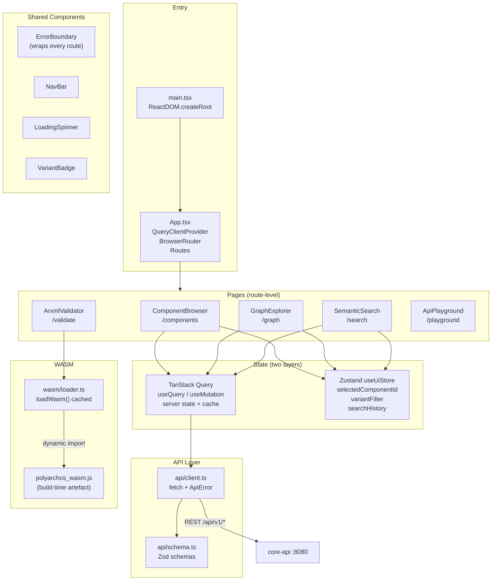
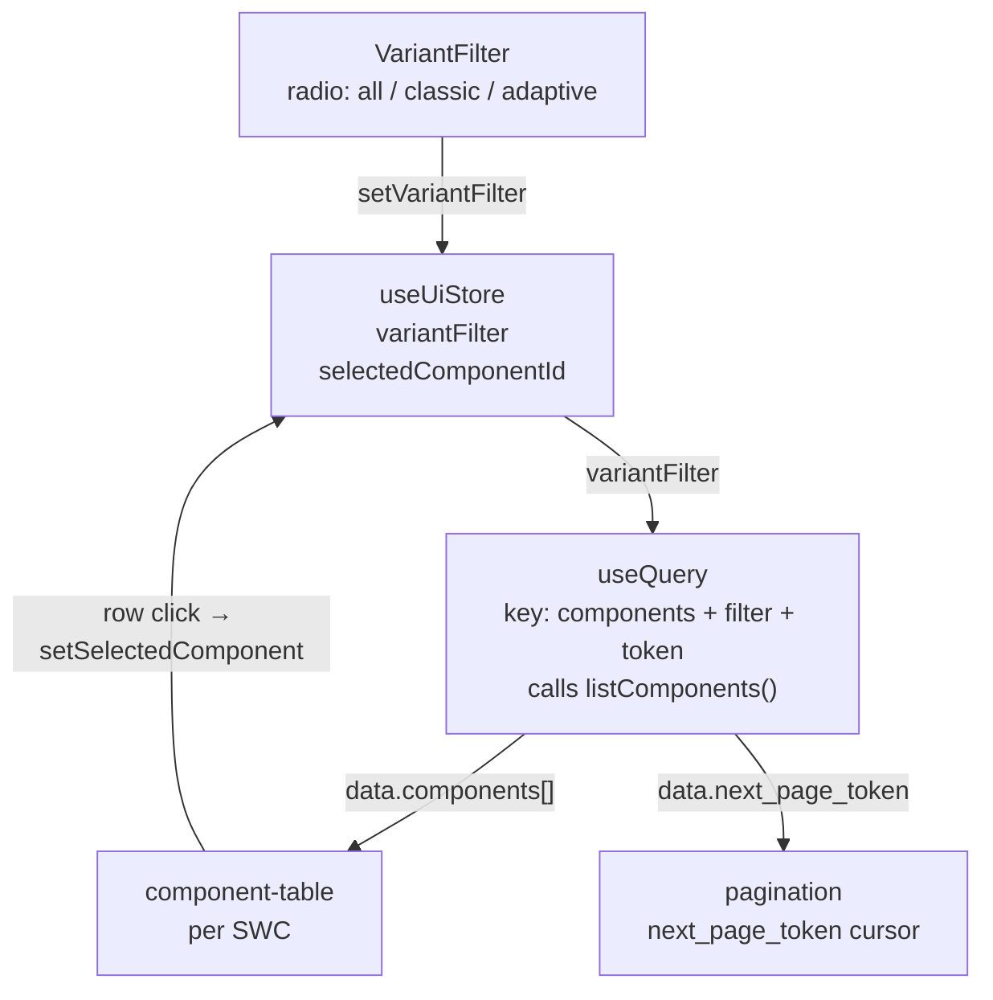
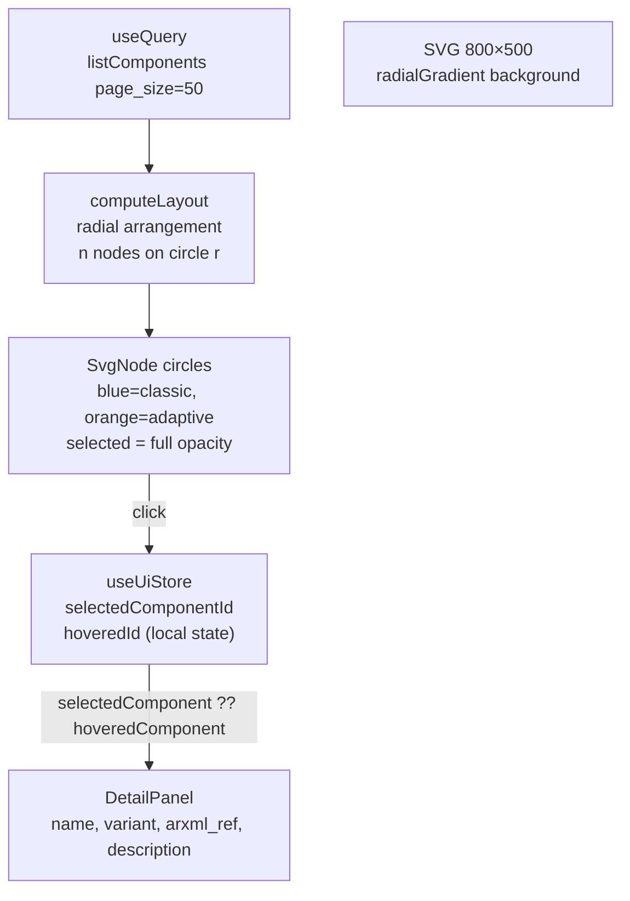
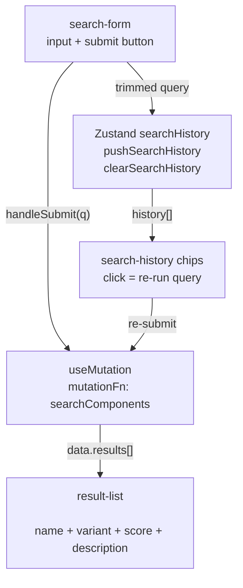
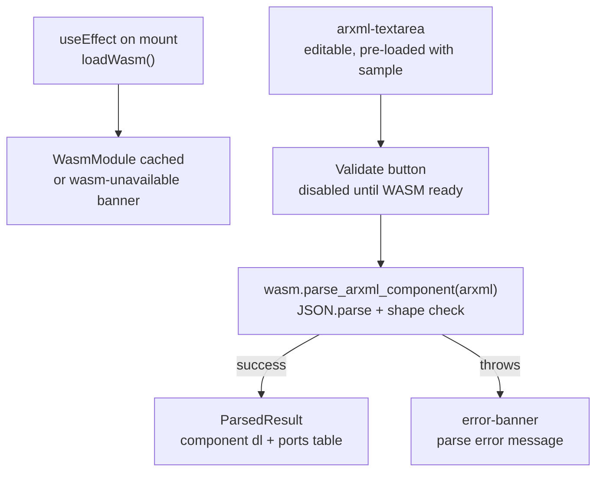
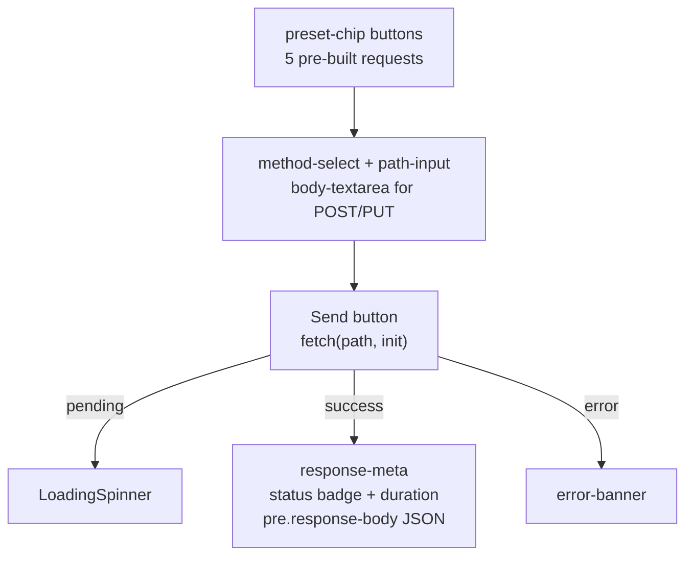

# frontend — Phase 5

React 18 + TypeScript strict single-page application. Five pages covering component browsing,
graph exploration, semantic search, in-browser ARXML validation, and a live REST API playground.

---

## Architecture



---

## File Structure

```
frontend/
├── index.html              # Vite entry HTML
├── package.json            # Dependencies + npm scripts
├── vite.config.ts          # Vite + Vitest config (WASM plugin, proxy, test alias)
├── tsconfig.json           # strict, noUncheckedIndexedAccess, exactOptionalPropertyTypes
├── vitest.setup.ts         # @testing-library/jest-dom import
└── src/
    ├── main.tsx            # createRoot entry point
    ├── App.tsx             # Route tree + providers
    ├── api/
    │   ├── schema.ts       # Zod schemas (derived from core-api OpenAPI)
    │   └── client.ts       # Type-safe fetch wrappers + ApiError
    ├── store/
    │   └── ui.ts           # Zustand store (client state only)
    ├── wasm/
    │   └── loader.ts       # Dynamic WASM import + LoadResult union
    ├── components/
    │   ├── ErrorBoundary.tsx    # Class component — route-level error catch
    │   ├── LoadingSpinner.tsx   # role="status" accessible spinner
    │   ├── NavBar.tsx           # NavLink-based navigation
    │   └── VariantBadge.tsx     # Classic/Adaptive pill badge
    ├── pages/
    │   ├── ComponentBrowser.tsx # Paginated SWC table + variant filter
    │   ├── GraphExplorer.tsx    # SVG radial graph + detail panel
    │   ├── SemanticSearch.tsx   # Mutation-based NL search + history
    │   ├── ArxmlValidator.tsx   # WASM parsing + result display
    │   └── ApiPlayground.tsx    # REST request builder + presets
    ├── styles/
    │   └── index.css       # Dark design system + component tokens
    ├── __mocks__/
    │   └── wasmStub.ts     # No-op WASM stub for Vitest
    └── __tests__/
        ├── schema.test.ts            # 8 Zod schema tests
        ├── ComponentBrowser.test.tsx # 7 component tests
        └── ArxmlValidator.test.tsx   # 5 component tests
```

---

## Pages

### ComponentBrowser (`/components`)



### GraphExplorer (`/graph`)



### SemanticSearch (`/search`)



### ArxmlValidator (`/validate`)



### ApiPlayground (`/playground`)



---

## State Management

Two separate concerns, two separate stores. (See [ADR-009](../docs/adr/ADR-009-frontend-state-management.md))

```
┌──────────────────────────────────────────────────────────────┐
│ TanStack Query — server state                                │
│                                                              │
│  Query keys:                                                 │
│    ['components', variantFilter, pageToken]  → list          │
│    ['components', null, undefined]           → graph (50)    │
│                                                              │
│  Mutations:                                                  │
│    searchComponents({ query, top_k })        → search        │
│                                                              │
│  staleTime: 30 s   retry: 1                                  │
└──────────────────────────────────────────────────────────────┘
┌──────────────────────────────────────────────────────────────┐
│ Zustand useUiStore — client state                            │
│                                                              │
│  selectedComponentId: string | null                          │
│  variantFilter: 'classic' | 'adaptive' | null                │
│  searchHistory: string[]  (max 10, FIFO eviction)            │
└──────────────────────────────────────────────────────────────┘
```

---

## API Layer

```typescript
// schema.ts — all shapes derived from core-api OpenAPI, never hand-invented
const ComponentResponseSchema = z.object({
  id: z.string().uuid(),
  arxml_ref: z.string(),
  name: z.string(),
  variant: AutosarVariantSchema,           // z.enum(['classic', 'adaptive'])
  description: z.string().optional(),      // exactOptionalPropertyTypes: absent ≠ undefined
})

// client.ts — typed wrappers
async function listComponents(query: ListComponentsQuery): Promise<ListComponentsResponse>
async function searchComponents(body: SearchRequest): Promise<SearchResponse>

// ApiError carries the HTTP status code for precise error handling
class ApiError extends Error { status: number }
```

---

## TypeScript Configuration

All three strict flags are active:

| Flag | Effect |
|---|---|
| `strict: true` | Enables all strict type checks |
| `noUncheckedIndexedAccess: true` | `arr[0]` is `T \| undefined`, not `T` |
| `exactOptionalPropertyTypes: true` | `{a?: string}` forbids explicit `undefined` assignment |

These constraints influence several patterns:

```typescript
// noUncheckedIndexedAccess — must guard array access
const first = results[0]  // type: SearchResult | undefined
if (first !== undefined) { console.log(first.score) }

// exactOptionalPropertyTypes — spread omission pattern
listComponents({
  page_size: 20,
  ...(pageToken !== undefined && { page_token: pageToken }),
  ...(variant !== null && { variant }),
})
```

---

## Running

```bash
# Install dependencies
npm install

# Dev server (proxies /api to localhost:8080)
npm run dev -w frontend

# Type check
npm run typecheck -w frontend

# Tests
npm run test -w frontend

# Production build
npm run build -w frontend
```

---

## Tests

```bash
npm run test -w frontend
# 3 test files, 20 tests, all passing

# Individual suites
npx vitest run src/__tests__/schema.test.ts
npx vitest run src/__tests__/ComponentBrowser.test.tsx
npx vitest run src/__tests__/ArxmlValidator.test.tsx
```

| File | Tests | What Is Tested |
|---|---|---|
| `schema.test.ts` | 8 | Zod parse/reject, optional fields, score range validation |
| `ComponentBrowser.test.tsx` | 7 | Loading state, data render, error banner, pagination, filter |
| `ArxmlValidator.test.tsx` | 5 | WASM load states, successful parse, error propagation |

WASM tests use a Vitest module alias pointing to `src/__mocks__/wasmStub.ts`, so no built binary
is required for the test suite.

---

## Dependencies

| Package | Version | Purpose |
|---|---|---|
| `react` | 18.x | UI framework |
| `react-dom` | 18.x | DOM renderer |
| `react-router-dom` | 6.x | Client-side routing |
| `@tanstack/react-query` | 5.x | Server state management |
| `zustand` | 4.x | Client state management |
| `zod` | 3.x | Runtime schema validation |
| `vite` | 5.x | Bundler + dev server |
| `vite-plugin-wasm` | 3.x | WASM ES module support |
| `vite-plugin-top-level-await` | 1.x | Top-level `await` for WASM init |
| `vitest` | 2.x | Test runner |
| `@testing-library/react` | 16.x | Component rendering + assertions |
| `typescript` | 5.x | Type system |
