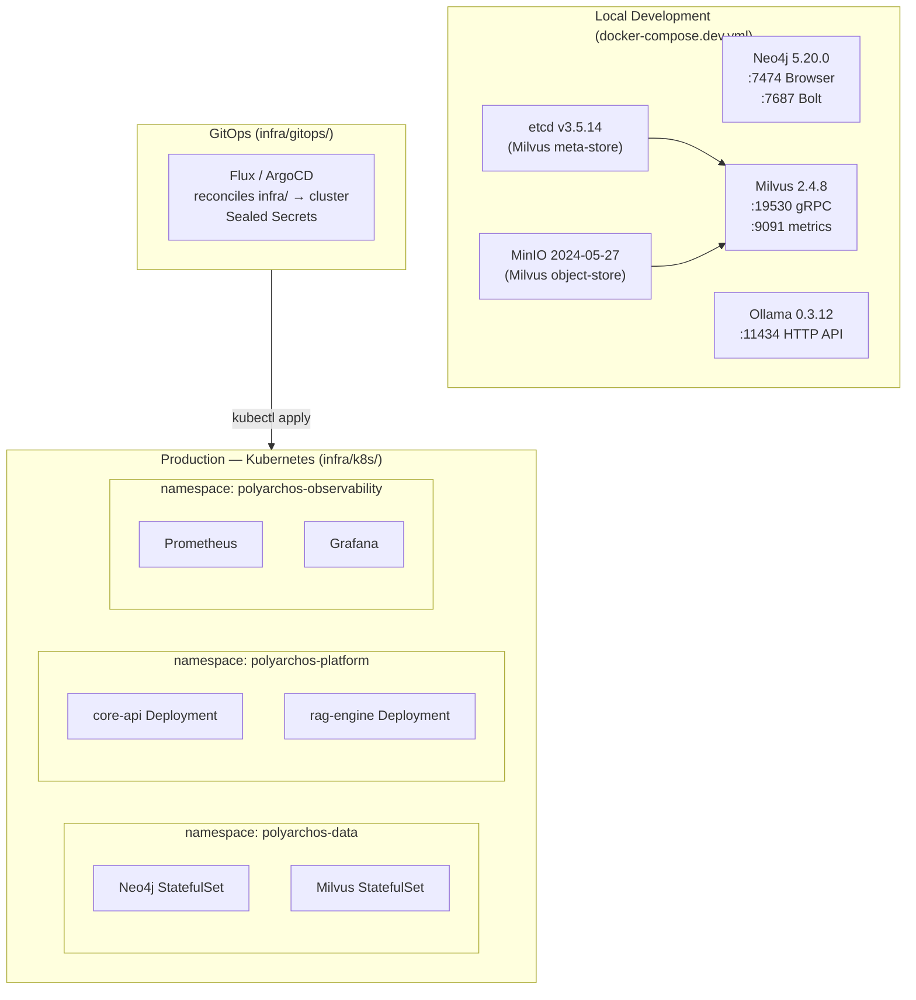
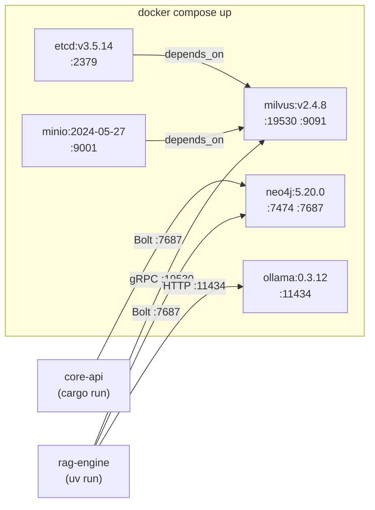
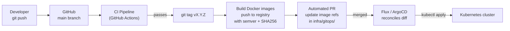

# infra — Infrastructure and Developer Stack

Infrastructure-as-code for all polyarchos environments: local Docker Compose for development,
Kubernetes manifests for production, and GitOps configuration for automated reconciliation.

---

## Overview



---

## Local Dev Stack

### `docker-compose.dev.yml`

Starts all stateful services needed to run polyarchos locally. Application services (core-api,
rag-engine) run outside Docker to allow fast `cargo run` / `uv run` iteration.



### Service Details

| Service | Image | Ports | Credentials / Notes |
|---|---|---|---|
| neo4j | `neo4j:5.20.0` | `7474` (UI), `7687` (Bolt) | `neo4j` / `polyarchos` |
| etcd | `quay.io/coreos/etcd:v3.5.14` | `2379` | Milvus metadata store |
| minio | `minio/minio:RELEASE.2024-05-27…` | `9001` (console) | `minioadmin` / `minioadmin` |
| milvus | `milvusdb/milvus:v2.4.8` | `19530` (gRPC), `9091` (metrics) | Depends on etcd + minio |
| ollama | `ollama/ollama:0.3.12` | `11434` | Models in named volume |

All images are pinned to exact semver tags — no `:latest` references. This mirrors the production
Kubernetes manifests where SHA256 digests are used instead.

### Quick Start

```bash
# 1. Start all services
docker compose -f infra/docker-compose.dev.yml up -d

# 2. Verify health
docker compose -f infra/docker-compose.dev.yml ps

# 3. Pull LLM (one-time, ~4 GB)
docker exec -it polyarchos-ollama ollama pull mistral:7b-instruct

# 4. Open Neo4j browser
open http://localhost:7474   # Login: neo4j / polyarchos

# 5. Stop (data persists in named volumes)
docker compose -f infra/docker-compose.dev.yml down

# 6. Full reset (wipes volumes)
docker compose -f infra/docker-compose.dev.yml down -v
```

### Named Volumes

| Volume | Service | Contains |
|---|---|---|
| `neo4j-data` | neo4j | Graph database files |
| `neo4j-logs` | neo4j | Log files |
| `etcd-data` | etcd | Milvus cluster metadata |
| `minio-data` | minio | Milvus segment files |
| `milvus-data` | milvus | Index files |
| `ollama-models` | ollama | Downloaded model weights |

---

## Kubernetes Manifests (`k8s/`)

Production workloads run on Kubernetes. Manifests are grouped by namespace.

```
infra/k8s/
├── data/
│   ├── neo4j/          # StatefulSet, PVC, Service, ConfigMap
│   └── milvus/         # StatefulSet, PVC, Service (+ etcd, minio)
├── platform/
│   ├── core-api/       # Deployment, Service, HPA, ConfigMap
│   └── rag-engine/     # Deployment, Service, ConfigMap, model-registry
└── observability/
    ├── prometheus/      # Deployment, ServiceMonitor, RBAC
    └── grafana/         # Deployment, ConfigMap (dashboard JSON)
```

### Image Reference Policy

All `image:` fields must use a SHA256 digest or pinned semver — never `:latest`:

```yaml
# Correct
image: milvusdb/milvus:v2.4.8

# Also acceptable (strongest — used in release)
image: milvusdb/milvus@sha256:abc123...

# Prohibited — fails CI image-lint check
image: milvusdb/milvus:latest
```

---

## GitOps (`gitops/`)

The GitOps controller (Flux or ArgoCD — see [ADR-005](../docs/adr/)) reconciles `infra/gitops/`
to the cluster. No manual `kubectl apply` in production.



### Secrets Management

Secrets are managed via Sealed Secrets or External Secrets Operator:

```
# SealedSecret (committed to git — encrypted)
apiVersion: bitnami.com/v1alpha1
kind: SealedSecret
metadata:
  name: neo4j-credentials
spec:
  encryptedData:
    NEO4J_PASSWORD: <base64 encrypted blob>

# Decrypted by the Sealed Secrets controller in the cluster only
```

Plaintext secrets are **never** committed. `.env.example` documents all required variables.

---

## Environment Variables Reference

See `.env.example` in the repo root for a full list. Key variables:

```bash
# core-api
CORE_API_GRPC_PORT=50051
CORE_API_REST_PORT=8080

# rag-engine
RAG_MILVUS_HOST=localhost
RAG_MILVUS_PORT=19530
RAG_NEO4J_URI=bolt://localhost:7687
RAG_NEO4J_USER=neo4j
RAG_NEO4J_PASSWORD=polyarchos
RAG_OLLAMA_BASE_URL=http://localhost:11434
RAG_OLLAMA_MODEL=mistral:7b-instruct
RAG_GRPC_PORT=50052
```

---

## Port Reference

| Service | Protocol | Port | Scope |
|---|---|---|---|
| core-api REST | HTTP | 8080 | External |
| core-api gRPC | HTTP/2 | 50051 | External / inter-service |
| rag-engine gRPC | HTTP/2 | 50052 | Internal only |
| Neo4j Browser | HTTP | 7474 | Dev only |
| Neo4j Bolt | TCP | 7687 | Internal |
| Milvus gRPC | HTTP/2 | 19530 | Internal |
| Milvus metrics | HTTP | 9091 | Internal |
| Ollama API | HTTP | 11434 | Internal |
| etcd | gRPC | 2379 | Internal |
| MinIO console | HTTP | 9001 | Dev only |
