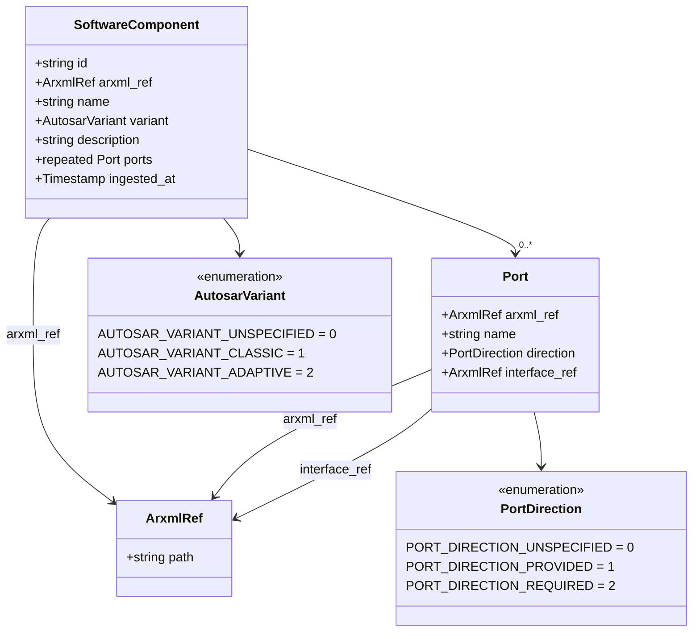
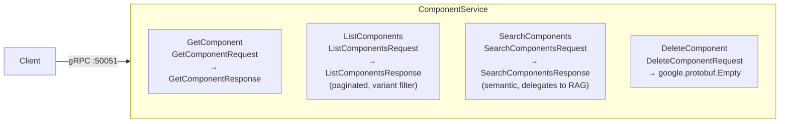
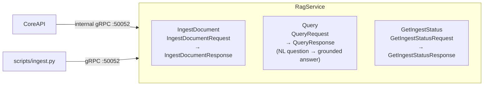
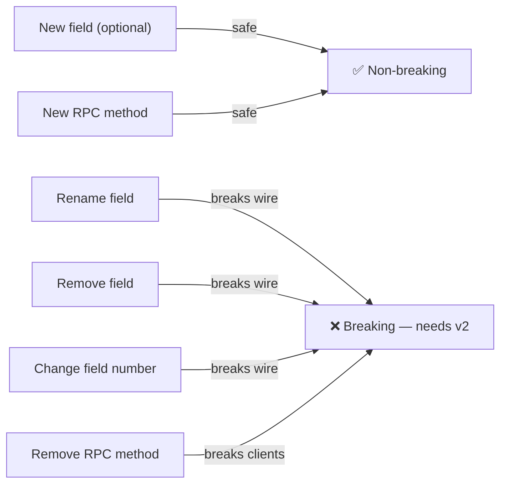

# proto — Phase 1: API Contracts

Protobuf definitions for all polyarchos services, managed by `buf`. These are the source of truth
for every inter-service API. Code generation happens at build time — generated stubs are never
committed.

---

## Design Principle

> Define the contract before writing the implementation.

Both core-api (Rust) and rag-engine (Python) consume these definitions. REST types in core-api
mirror the proto messages but are annotated separately for utoipa/OpenAPI. (See [ADR-003](../docs/adr/ADR-003-proto-first-api-design.md))

---

## Package Structure

```
proto/
├── buf.yaml                        # buf workspace config (linting: BASIC ruleset)
└── polyarchos/
    ├── core/v1/
    │   ├── component.proto         # Domain messages: SoftwareComponent, Port, …
    │   └── service.proto           # ComponentService RPC definitions
    └── rag/v1/
        └── service.proto           # RagService RPC definitions
```

Package namespaces follow `polyarchos.<domain>.<version>`:

| Package | Service | Port |
|---|---|---|
| `polyarchos.core.v1` | `ComponentService` | gRPC :50051 (core-api) |
| `polyarchos.rag.v1` | `RagService` | gRPC :50052 (rag-engine) |

---

## Message Model



---

## ComponentService (polyarchos.core.v1)



### Pagination Contract

```
ListComponentsRequest {
  page_size: int32       // 1–200; default 50
  page_token: string     // opaque cursor from previous response; empty = first page
  variant_filter: AutosarVariant  // UNSPECIFIED = all variants
}

ListComponentsResponse {
  components: repeated SoftwareComponent
  next_page_token: string  // empty = last page
  total_count: int32       // total matching regardless of pagination
}
```

---

## RagService (polyarchos.rag.v1)



### Message Shapes

```protobuf
// Ingestion
message IngestDocumentRequest {
  bytes arxml_content = 1;     // Raw ARXML XML bytes
  string document_name = 2;    // Human-readable source label
}

message IngestDocumentResponse {
  string job_id = 1;
  int32 components_indexed = 2;
  int32 graph_edges_created = 3;
  google.protobuf.Timestamp completed_at = 4;
}

// Querying
message QueryRequest {
  string question = 1;         // e.g. "Which SWCs communicate over CAN?"
  int32 context_chunks = 2;    // Milvus top-k; default 5, max 20
}

message QueryResponse {
  string answer = 1;
  repeated SourceChunk sources = 2;
  string model_id = 3;         // e.g. "mistral:7b-instruct"
}

message SourceChunk {
  string document_name = 1;
  string text = 2;
  float relevance_score = 3;   // cosine similarity [0, 1]
}
```

---

## Versioning and Breaking Changes



`buf breaking` runs in CI against `main`:

```bash
buf breaking --against '.git#branch=main'
```

Any breaking change that is not paired with a version bump fails the CI pipeline.

---

## Code Generation

Generated stubs are never committed. They are created at build time:

```bash
buf generate
```

`buf.gen.yaml` controls output paths:

| Language | Target | Output Path |
|---|---|---|
| Rust | `services/core-api` | `src/generated/` (via `tonic-build` in `build.rs`) |
| Python | `services/rag-engine` | `src/generated/` (via `grpcio-tools`) |

---

## Linting Rules

`buf.yaml` applies the `BASIC` ruleset:

- All fields must be `snake_case`
- All enum values must be `SCREAMING_SNAKE_CASE`
- All enums must have a `_UNSPECIFIED = 0` value
- All RPCs must have request/response message types (no reuse)
- Timestamps must use `google.protobuf.Timestamp` (no raw `int64` epoch)

```bash
buf lint                          # Check all .proto files
buf format --diff                 # Preview formatting changes
buf format -w                     # Apply formatting in place
```
