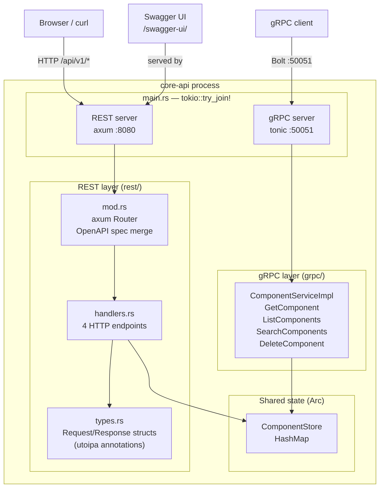
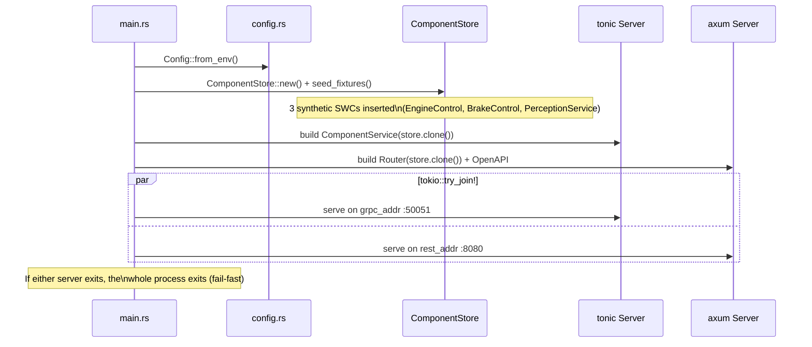
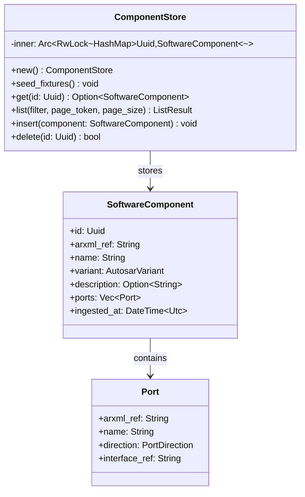

# core-api — Phase 2

Rust API gateway that exposes all polyarchos functionality over both gRPC and REST in a single
binary. It is the **only** externally-facing service — the frontend and all external clients talk
exclusively to core-api.

---

## Architecture



---

## File Structure

```
services/core-api/
├── Cargo.toml          # Crate manifest + dependencies
├── build.rs            # tonic-build: compiles proto/ → src/generated/
└── src/
    ├── main.rs              # Entry point, dual-server startup
    ├── config.rs            # Environment config (CORE_API_GRPC_PORT, _REST_PORT)
    ├── error.rs             # AppError: Into<tonic::Status> + IntoResponse
    ├── grpc/
    │   ├── mod.rs           # Re-exports proto stubs
    │   └── component_service.rs  # ComponentService RPC implementation
    ├── rest/
    │   ├── mod.rs           # axum Router + utoipa OpenAPI merge
    │   ├── handlers.rs      # HTTP endpoint functions
    │   └── types.rs         # REST structs (ComponentResponse, ListComponentsResponse…)
    └── store/
        └── mod.rs           # ComponentStore + synthetic seed data
```

---

## Dual-Server Startup



---

## REST API

### Endpoints

| Method | Path | Handler | Description |
|---|---|---|---|
| `GET` | `/api/v1/components` | `list_components` | Paginated list with optional variant filter |
| `GET` | `/api/v1/components/:id` | `get_component` | Fetch single SWC by UUID |
| `POST` | `/api/v1/components/search` | `search_components` | Semantic search (delegates to rag-engine) |
| `DELETE` | `/api/v1/components/:id` | `delete_component` | Remove SWC from store |
| `GET` | `/api-docs/openapi.json` | utoipa | Machine-readable OpenAPI spec |
| `GET` | `/swagger-ui/` | utoipa-swagger-ui | Interactive API explorer |

### Query Parameters — `GET /api/v1/components`

| Param | Type | Default | Description |
|---|---|---|---|
| `page_size` | int | 50 | Max 200 |
| `page_token` | string | — | Opaque cursor from previous response |
| `variant` | string | — | `classic` or `adaptive` |

### Response Shapes

```json
// GET /api/v1/components
{
  "components": [
    {
      "id": "123e4567-e89b-12d3-a456-426614174000",
      "arxml_ref": "/MyECU/EngineControlSWC",
      "name": "EngineControlSWC",
      "variant": "classic",
      "description": "Engine control software component"
    }
  ],
  "next_page_token": "eyJvZmZzZXQiOjIwfQ==",
  "total_count": 42
}

// POST /api/v1/components/search
// Request: {"query": "brake pressure", "top_k": 5}
{
  "results": [
    {
      "component": { "id": "...", "name": "BrakeControlSWC", ... },
      "score": 0.923
    }
  ]
}
```

---

## gRPC API (polyarchos.core.v1)

```protobuf
service ComponentService {
  // Returns a single SWC by ID. Errors with NOT_FOUND if absent.
  rpc GetComponent(GetComponentRequest) returns (GetComponentResponse);

  // Paginated listing with optional variant filter.
  rpc ListComponents(ListComponentsRequest) returns (ListComponentsResponse);

  // Semantic search — delegates to rag-engine internally.
  rpc SearchComponents(SearchComponentsRequest) returns (SearchComponentsResponse);

  // Removes a component from the store.
  rpc DeleteComponent(DeleteComponentRequest) returns (google.protobuf.Empty);
}
```

---

## ComponentStore

Thread-safe, in-memory store. Phase 6 will replace this with a persistent Neo4j-backed store.



---

## Error Handling

```rust
// error.rs — AppError is the single error type for the whole service
enum AppError {
    NotFound(Uuid),        // → HTTP 404 / gRPC NOT_FOUND
    InvalidRequest(String),// → HTTP 400 / gRPC INVALID_ARGUMENT
    Internal(String),      // → HTTP 500 / gRPC INTERNAL
}

// Automatically converts to axum response body: {"error": "..."}
// Automatically converts to tonic::Status for gRPC
```

---

## Running

```bash
# From workspace root
cargo run -p core-api

# With custom ports
CORE_API_GRPC_PORT=50051 CORE_API_REST_PORT=8080 cargo run -p core-api

# Tests
cargo test -p core-api

# Lint
cargo clippy -p core-api -- -D warnings
```

---

## Dependencies

| Crate | Version | Purpose |
|---|---|---|
| `tokio` | 1.x | Async runtime (multi-thread) |
| `tonic` | 0.12 | gRPC server and generated stubs |
| `axum` | 0.7 | HTTP REST server |
| `utoipa` | 4.x | OpenAPI 3 spec generation from handler annotations |
| `utoipa-swagger-ui` | 7.x | Embedded Swagger UI served from `/swagger-ui/` |
| `serde` + `serde_json` | 1.x | JSON serialisation |
| `tower-http` | 0.5 | CORS + tracing middleware |
| `uuid` | 1.x | UUID v4 generation + serde |
| `tracing` | 0.1 | Structured logging |
| `thiserror` | 1.x | Typed error derive |
| `anyhow` | 1.x | Error context at binary entry point |

---

## Design Decisions

- **ADR-003** — Proto-first API: all message shapes defined in `proto/` before any Rust code.
- **ADR-004** — Dual server: gRPC and REST run concurrently in one process via `tokio::try_join!`.
  If either exits, the whole process exits (fail-fast). Both share the same `ComponentStore` via
  `Arc<RwLock<_>>` — zero data copying between the two servers.
- Proto-generated types are mapped to domain types at the service boundary; they never leak into
  the store or handler layer.
