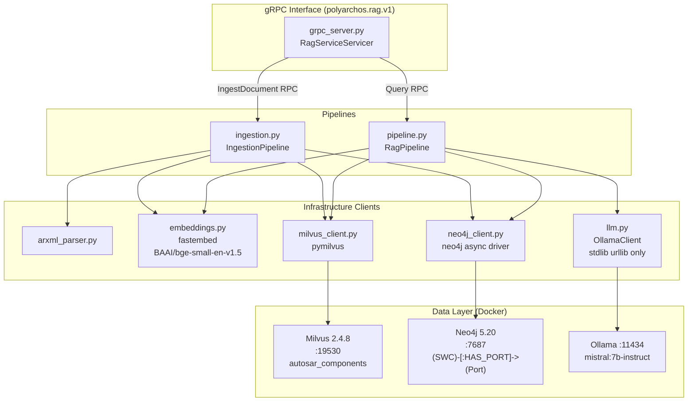

# rag-engine — Phase 4

Python service that ingests ARXML documents into a vector + graph database and answers
natural-language questions about the AUTOSAR component landscape using a locally-hosted LLM.
All inference is offline — no external API calls.

---

## Architecture



---

## File Structure

```
services/rag-engine/
├── pyproject.toml             # Dependencies, scripts, mypy/ruff/pytest config
└── src/rag_engine/
    ├── __init__.py
    ├── main.py                # Entry: init clients, start gRPC server
    ├── config.py              # Pydantic Settings (env vars: RAG_*)
    ├── arxml_parser.py        # XML → SoftwareComponentRecord + PortRecord
    ├── embeddings.py          # fastembed wrapper (embed, embed_one)
    ├── milvus_client.py       # Milvus collection mgmt, upsert, ANN search
    ├── neo4j_client.py        # Neo4j async driver (MERGE nodes, graph queries)
    ├── llm.py                 # Ollama HTTP client (POST /api/generate)
    ├── ingestion.py           # End-to-end ARXML ingest pipeline
    ├── pipeline.py            # RAG query pipeline (4 steps)
    └── grpc_server.py         # gRPC RagServiceServicer

tests/
    ├── test_arxml_parser.py   # 14 tests
    ├── test_ingestion.py      # 7 tests
    └── test_pipeline.py       # 8 tests
```

---

## Ingestion Pipeline

Converts raw ARXML XML bytes into indexed Milvus embeddings and Neo4j graph nodes.

```mermaid
flowchart LR
    A([ARXML bytes\ndocument_name]) --> B

    subgraph Step1["Step 1 · Parse"]
        B["arxml_parser.py\nparse_arxml(content, document_name)"]
        B --> B1["Strip {namespace} prefix\n_strip_ns(tag)"]
        B1 --> B2["Walk AR-PACKAGE tree\nrecursively find SWC elements"]
        B2 --> B3["Extract ports\nP-PORT / R-PORT prototypes"]
        B3 --> B4["Build /Pkg/Sub/SWC\narxml_ref path"]
    end

    B4 --> C

    subgraph Step2["Step 2 · Embed"]
        C["SWC → text chunk\n.to_text_chunk()"]
        C --> D["embeddings.py\nfastembed.TextEmbedding\nBAAI/bge-small-en-v1.5"]
        D --> E["384-dim float vectors\none per SWC"]
    end

    E --> F
    B4 --> G

    subgraph Step3a["Step 3a · Vector Store"]
        F["milvus_client.py\nupsert_chunks()"]
        F --> F1["DELETE WHERE arxml_ref = X\n(idempotent)"]
        F1 --> F2["INSERT ComponentChunk\nrow per SWC"]
    end

    subgraph Step3b["Step 3b · Graph Store"]
        G["neo4j_client.py\nupsert_component()"]
        G --> G1["MERGE SoftwareComponent\nnode on arxml_ref"]
        G1 --> G2["MERGE Port nodes\n[:HAS_PORT]"]
        G2 --> G3["MERGE Interface nodes\n[:REALIZES] / [:REQUIRES_INTERFACE]"]
    end

    F2 --> H([IngestionResult\ncomponents_indexed\ngraph_edges_created])
    G3 --> H
```



---

## RAG Query Pipeline

Answers a natural-language question about the AUTOSAR component landscape.

```mermaid
flowchart LR
    Q([question: str\ntop_k: int]) --> S1

    subgraph S1["Step 1 · Embed"]
        E["embeddings.py\nembed_one(question)"]
        E --> EV["384-dim query vector"]
    end

    EV --> S2

    subgraph S2["Step 2 · Retrieve"]
        MV["milvus_client.py\nsearch(vector, top_k)"]
        MV --> MR["SearchResult list\narxml_ref + text_chunk + score"]
    end

    MR --> S3
    MR --> S4

    subgraph S3["Step 3 · Graph Enrich"]
        NC["neo4j_client.py\nget_component_context(arxml_refs)"]
        NC --> NT["Cypher: MATCH SWC-[:HAS_PORT]->\n(:Port)-[:REALIZES]->(:Interface)"]
        NT --> GC["Graph context\nport topology strings"]
    end

    subgraph S4["Step 4 · Generate"]
        PT["Build prompt\n_PROMPT_TEMPLATE\nchunks + graph context + question"]
        GC --> PT
        PT --> OL["llm.py OllamaClient\nPOST /api/generate\nmistral:7b-instruct stream=false"]
        OL --> ANS["answer: str"]
    end

    ANS --> R([QueryResult\nanswer + sources + model_id])
    MR --> R
```



---

## gRPC Service (polyarchos.rag.v1)

```protobuf
service RagService {
  rpc IngestDocument(IngestDocumentRequest) returns (IngestDocumentResponse);
  rpc Query(QueryRequest) returns (QueryResponse);
  rpc GetIngestStatus(GetIngestStatusRequest) returns (GetIngestStatusResponse);
}
```

### RPC Details

| RPC | Request | Response | Description |
|---|---|---|---|
| `IngestDocument` | `arxml_content` (bytes), `document_name` (string) | `job_id`, `components_indexed`, `graph_edges_created` | Parse ARXML, embed, and store |
| `Query` | `question` (string), `context_chunks` (int) | `answer`, `sources[]`, `model_id` | RAG query over indexed data |
| `GetIngestStatus` | `job_id` (string) | `status`, `error` | Check async ingest job |

---

## Configuration

All config is read from environment variables with `RAG_` prefix (Pydantic Settings).

| Variable | Default | Description |
|---|---|---|
| `RAG_MILVUS_HOST` | `localhost` | Milvus host |
| `RAG_MILVUS_PORT` | `19530` | Milvus gRPC port |
| `RAG_MILVUS_COLLECTION` | `autosar_components` | Collection name |
| `RAG_NEO4J_URI` | `bolt://localhost:7687` | Neo4j Bolt URI |
| `RAG_NEO4J_USER` | `neo4j` | Neo4j username |
| `RAG_NEO4J_PASSWORD` | `polyarchos` | Neo4j password |
| `RAG_OLLAMA_BASE_URL` | `http://localhost:11434` | Ollama API URL |
| `RAG_OLLAMA_MODEL` | `mistral:7b-instruct` | Model name |
| `RAG_OLLAMA_TIMEOUT_S` | `120` | Generation timeout |
| `RAG_EMBEDDING_MODEL` | `BAAI/bge-small-en-v1.5` | fastembed model |
| `RAG_EMBEDDING_DIM` | `384` | Vector dimension |
| `RAG_GRPC_PORT` | `50052` | rag-engine gRPC port |

---

## Data Models

### SoftwareComponentRecord (arxml_parser.py)

```python
@dataclass
class SoftwareComponentRecord:
    name: str
    arxml_ref: str          # e.g. "/MyECU/EngineControlSWC"
    variant: AutosarVariant # CLASSIC | ADAPTIVE
    description: str | None
    ports: list[PortRecord]
    document_name: str

    def to_text_chunk(self) -> str:
        # "SWC EngineControlSWC (classic) at /MyECU/EngineControlSWC.
        #  Ports: FuelInjectionPort (provided) via /Interfaces/FuelInjectionIf"
```

### Milvus Schema (autosar_components)

```
┌────────────────┬──────────────────┬──────────────────────────────┐
│ Field          │ Type             │ Notes                        │
├────────────────┼──────────────────┼──────────────────────────────┤
│ id             │ INT64 (PK auto)  │ Milvus-assigned              │
│ arxml_ref      │ VARCHAR(512)     │ Used as dedup/delete key     │
│ document_name  │ VARCHAR(256)     │ Source ARXML filename        │
│ component_name │ VARCHAR(256)     │                              │
│ variant        │ VARCHAR(32)      │ "classic" or "adaptive"      │
│ text_chunk     │ VARCHAR(4096)    │ Human-readable text          │
│ embedding      │ FLOAT_VECTOR(384)│ IVF_FLAT index, IP metric   │
└────────────────┴──────────────────┴──────────────────────────────┘
Index: IVF_FLAT with nlist=128
Metric: IP (inner product = cosine similarity on normalised vectors)
```

### Neo4j Graph Schema

```
(:SoftwareComponent {arxml_ref, name, variant})
    -[:HAS_PORT]─▶ (:Port {arxml_ref, name, direction})
                       -[:REALIZES]──────────▶ (:Interface {arxml_ref})
                       -[:REQUIRES_INTERFACE]─▶ (:Interface {arxml_ref})
```

---

## Running

```bash
# Install package
uv pip install -e services/rag-engine

# Generate proto stubs (required before first run)
buf generate

# Start dev stack
docker compose -f infra/docker-compose.dev.yml up -d
docker exec -it polyarchos-ollama ollama pull mistral:7b-instruct

# Start the service
uv run rag-engine

# Ingest a file
uv run python scripts/ingest.py --input tests/fixtures/sample.arxml --document-name sample
```

---

## Tests

```bash
# All tests (mocked — no live infrastructure needed)
uv run pytest services/rag-engine/tests -v

# Type check
uv run mypy services/rag-engine --strict

# Lint
uv run ruff check services/rag-engine
```

Test summary:

| File | Tests | Strategy |
|---|---|---|
| `test_arxml_parser.py` | 14 | Pure unit — no mocks needed |
| `test_ingestion.py` | 7 | Mock Milvus + Neo4j + embedder |
| `test_pipeline.py` | 8 | Mock all 4 pipeline dependencies |

---

## Design Decisions

- **ADR-006** — No RAG framework (LangChain / LlamaIndex). The pipeline is ~80 lines of plain
  Python with explicit step boundaries. Easier to debug, audit, and adapt.
- **ADR-007** — Ollama + mistral:7b-instruct. Single binary, built-in model management, 4-bit
  quantized (~4 GB), strong instruction-following.
- **ADR-008** — Offline inference. `llm.py` uses only `stdlib urllib` — no `openai` or `anthropic`
  imports. `fastembed` downloads models to a local cache that can be pre-populated for air-gap
  deployment.
- Idempotent ingestion: Milvus deletes rows by `arxml_ref` before re-inserting; Neo4j uses `MERGE`
  on all nodes. Re-ingesting the same file is safe and produces the same state.
