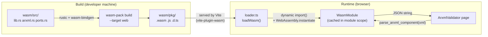
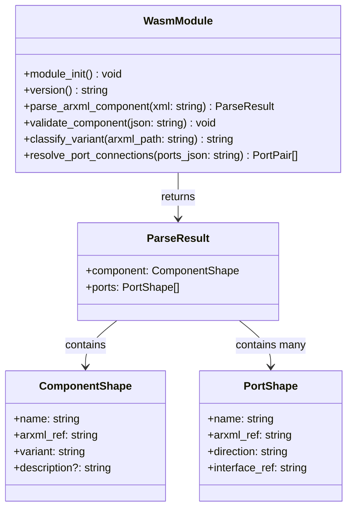
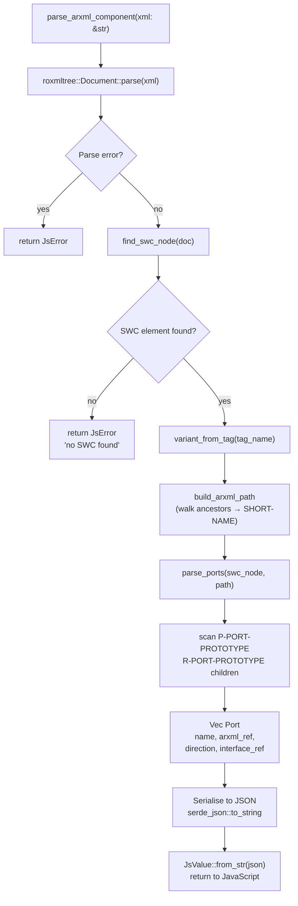

# wasm — Phase 3

Rust crate compiled to WebAssembly that provides AUTOSAR domain logic — specifically ARXML parsing
and port-compatibility resolution — directly inside the browser. Zero server round-trip.

---

## Architecture



---

## File Structure

```
wasm/
├── Cargo.toml          # wasm32 target, wasm-bindgen, roxmltree, wasm-opt config
└── src/
    ├── lib.rs          # #[wasm_bindgen] exports — public API surface
    ├── arxml.rs        # Internal ARXML parsing helpers (not exported)
    └── ports.rs        # Port compatibility matching (not exported)

wasm/pkg/               # Generated by wasm-pack (gitignored)
    ├── polyarchos_wasm_bg.wasm       # ~163 KB optimised binary
    ├── polyarchos_wasm.js            # ES module loader (init + exports)
    ├── polyarchos_wasm.d.ts          # Auto-generated TypeScript declarations
    └── polyarchos_wasm_bg.wasm.d.ts  # WASM memory type bindings
```

---

## Exported API

All exported functions are documented in `lib.rs` and auto-typed via the generated `.d.ts`.



### Function Descriptions

| Function | Input | Output | Notes |
|---|---|---|---|
| `module_init()` | — | void | Installed automatically on WASM init via `#[wasm_bindgen(start)]`; sets up `console_error_panic_hook` |
| `version()` | — | `"0.1.0"` | Returns crate version |
| `parse_arxml_component(xml)` | ARXML string | `{component, ports}` JSON | Main entry point; throws on malformed XML |
| `validate_component(json)` | ComponentShape JSON | void | Throws `JsError` listing all validation failures |
| `classify_variant(path)` | arxml_ref string | `"classic"` \| `"adaptive"` | Heuristic on path segments |
| `resolve_port_connections(json)` | `Port[]` JSON | `[provided, required][]` JSON | Finds compatible port pairs by interface_ref |

---

## Internal Parse Flow



### Supported SWC Element Tags

| ARXML Element | Variant |
|---|---|
| `APPLICATION-SW-COMPONENT-TYPE` | Classic |
| `COMPOSITION-SW-COMPONENT-TYPE` | Classic |
| `SERVICE-COMPONENT-TYPE` | Classic |
| `ECU-ABSTRACTION-SW-COMPONENT-TYPE` | Classic |
| `SENSOR-ACTUATOR-SW-COMPONENT-TYPE` | Classic |
| `COMPLEX-DEVICE-DRIVER-SW-COMPONENT-TYPE` | Classic |
| `ADAPTIVE-APPLICATION-SW-COMPONENT-TYPE` | Adaptive |

---

## Build

```bash
# Standard build (release, web target)
wasm-pack build wasm/ --target web

# Output lands in wasm/pkg/ (served by Vite in the frontend)

# Unit tests (runs on native, not WASM target)
wasm-pack test wasm/ --headless --chrome
# or
cargo test -p polyarchos-wasm

# Check build artefact size
ls -lh wasm/pkg/polyarchos_wasm_bg.wasm
```

### wasm-opt Configuration

`roxmltree` uses bulk memory instructions (`memory.copy`, `memory.fill`). The bundled `wasm-opt`
in older `wasm-pack` versions rejects these. The following override in `Cargo.toml` passes the
required flag:

```toml
[package.metadata.wasm-pack.profile.release]
wasm-opt = ["--enable-bulk-memory", "-O"]
```

---

## Browser Integration

```typescript
// frontend/src/wasm/loader.ts
export type LoadResult =
  | { status: 'ok'; module: WasmModule }
  | { status: 'unavailable'; reason: string }

export async function loadWasm(): Promise<LoadResult> {
  // Dynamic import — Vite resolves the path at bundle time.
  // @ts-expect-error — generated at build time, not in git.
  const mod = await import(/* @vite-ignore */ '../../wasm/pkg/polyarchos_wasm.js')
  await mod.default()          // run WASM init + module_init() panic hook
  return { status: 'ok', module: mod }
}
```

The loader result is cached at module scope — WASM is initialised at most once per page load
regardless of how many components call `loadWasm()`.

Test environments stub the WASM module via a Vitest alias:

```typescript
// vite.config.ts (test section)
alias: {
  '../../wasm/pkg/polyarchos_wasm.js': '/src/__mocks__/wasmStub.ts',
}
```

---

## Test Coverage

```
wasm/src/lib.rs   — 3 unit tests (version, parse round-trip, validate)
wasm/src/arxml.rs — 9 unit tests (variant detection, path building, port parsing,
                                   namespace variants, malformed XML)
wasm/src/ports.rs — 4 unit tests (compatible pairs, no match, asymmetric, empty)

Total: 16 tests — all passing
Run: cargo test -p polyarchos-wasm
```

---

## Design Decisions

- **ADR-005** — WASM was chosen over a backend round-trip (latency) and TypeScript reimplementation
  (duplication risk). Rust → WASM reuses domain logic, produces typed `.d.ts` declarations, and
  supports fully offline use. The ARXML validator page works with no network connection.
- `roxmltree` was chosen over `xml-rs` for its zero-copy document model (important for the 163 KB
  binary budget) and first-class namespace support.
- All `#[wasm_bindgen]`-exported paths are panic-free. `JsError` is used for recoverable failures;
  the panic hook converts unexpected panics to `console.error` messages in the browser.
